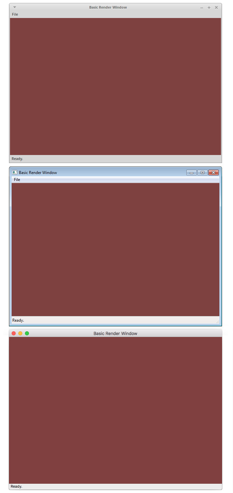

# project-cmake-wxaui-gl
Cross-platform wxWidgets AUI base application with OpenGL support

This project provides a simple starting point for writing cross-platform OpenGL applications using wxWidgets.  It's mostly a reminder to myself on how to to get up and running quickly across Linux, Windows and OSX desktops using CMake.

The UI is built with [wxAUI](http://docs.wxwidgets.org/3.0/overview_aui.html "wxAUI"), which supports dockable panes, splitters, toolbars, etc. The default rendering pane inherits from [wxGLCanvas](http://docs.wxwidgets.org/3.0/classwx_g_l_canvas.html "wxGLCanvas") to initialize a modern OpenGL context.

CMake projects were tested on Linux ("Unix Makefiles"), Windows ("Visual Studio 12 2013"), and OSX ("Xcode")

